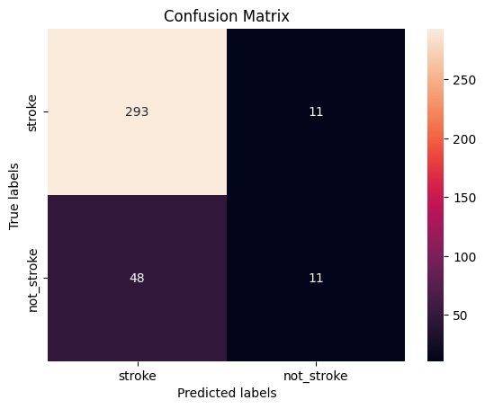
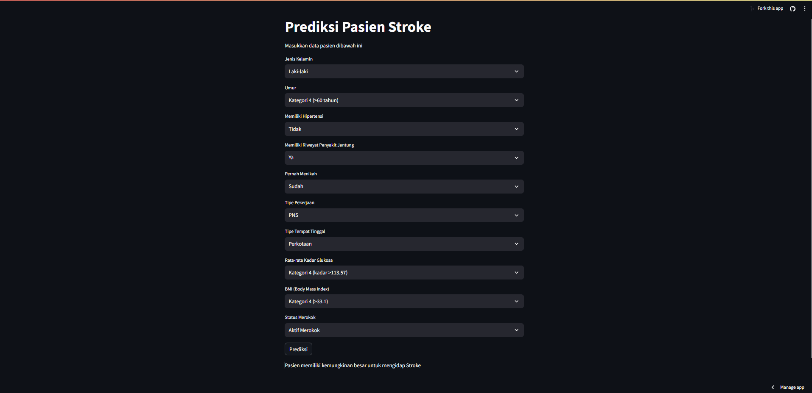

# Laporan Proyek Machine Learning

<table>
<tr>
<td>Nama</td>
<td>:</td>
<td>Muhammad Ridwan Wibisono</td>
</tr>
<tr>
<td>NIM</td>
<td>:</td>
<td>211351098</td>
</tr>
<tr>
<td>Kelas</td>
<td>:</td>
<td>Informatika Malam A</td>
</tr>
</table>

## Domain Proyek

Prediksi penyakit stroke ini merupakan suatu sistem yang mampu melakukan prediksi yang dapat membantu dalam menilai apakah seorang pasien memiliki atau tidaknya risiko yang signifikan untuk mengidap penyakit stroke, dan hal ini didasarkan pada data medis yang tersedia atau diberikan.

## Business Understanding

Tahap awal yang bertujuan untuk memprediksi apakah pasien memiliki peluang mengidap penyakit stroke atau tidak. Dalam tahap ini, kita akan mengidentifikasi, merinci, dan memahami masalah yang ingin diselesaikan oleh aplikasi ini.

Bagian laporan ini mencakup:

### Problem Statements

- Keterlambatan dalam deteksi dini penyakit stroke, yang berpotensi mengakibatkan peningkatan insiden stroke yang dapat dicegah.
- Kesulitan dalam mengidentifikasi faktor risiko stroke yang spesifik pada pasien, yang dapat mengarah pada manajemen risiko yang tidak tepat.
- Kurangnya dukungan dalam mengarahkan pasien pada tindakan pencegahan yang sesuai, seperti perubahan gaya hidup atau penggunaan obat-obatan yang sesuai.

### Goals

- Meningkatkan deteksi dini penyakit stroke sehingga dapat mengurangi insiden stroke yang dapat dicegah.
- Meningkatkan identifikasi faktor risiko stroke yang spesifik pada pasien untuk pengelolaan risiko yang lebih tepat.
- Memberikan rekomendasi yang lebih tepat dalam pencegahan penyakit stroke, termasuk perubahan gaya hidup, pengobatan, dan tindakan pencegahan lainnya.

### Solution statements
- Mengembangkan model prediksi berbasis data yang menggunakan algoritma machine learning untuk memprediksi risiko penyakit stroke pada pasien. Model ini akan memanfaatkan data medis yang relevan, termasuk faktor risiko, riwayat kesehatan, dan hasil tes laboratorium.
- Model yang dihasilkan dari datasets itu menggunakan metode Random Forest Classifier.

## Data Understanding
Dataset yang saya gunakan berasal dari Kaggle yang berisi data medis yang relevan. Dataset ini merupakan sekumpulan data riwayat medis pasien. Dataset ini mengandung 5.111 baris dan 10 columns setelah dilakukan data cleaning.<br> 

[Stroke Prediction Dataset](https://www.kaggle.com/datasets/fedesoriano/stroke-prediction-dataset).


### Variabel-variabel pada Stroke Prediction Dataset adalah sebagai berikut:
- **id**                : Menunjukkan pengenal unik (unique identifier) [int64]
- **gender**            : Menunjukkan jenis kelamin pasien. [object]
- **age**               : Menunjukkan usia pasien. [float64]
- **hypertension**      : Menunjukkan indikator hipertensi. [Bernilai 0 jika pasien tidak memiliki hipertensi, dan 1 jika pasien memiliki hipertensi] [int64]
- **heart_disease**     : Menunjukkan indikator penyakit jantung.   [bernilai 0 jika pasien tidak memiliki penyakit jantung, dan 1 jika pasien memiliki penyakit jantung] [int64]
- **ever_married**      : Status pernikahan pasien, dapat berupa "Tidak" atau "Ya."  [object]
- **work_type**         : Jenis pekerjaan pasien, termasuk "Anak-anak," "PNS," "Tidak Pernah Bekerja," "Swasta," atau "Wiraswasta."  [object]
- **Residence_type**    : Jenis tempat tinggal pasien, dapat berupa "Pedesaan" atau "Perkotaan."  [object]
- **avg_glucose_level** : Rata-rata tingkat glukosa dalam darah pasien.  [float64]
- **bmi**               : Indeks massa tubuh pasien.  [float64]
- **smoking_status**    : Status merokok pasien, termasuk "Pernah Merokok," "Tidak Pernah Merokok," "Merokok," atau "Tidak Diketahui."  [object]
- **stroke**            : Indikator stroke. [Bernilai 1 jika pasien pernah mengalami stroke, dan 0 jika tidak]. [int64]

## Data Preparation
Pada tahap ini, saya menggunakan metode EDA untuk melakukan preparasi data.
### Data Collection
Untuk data collection ini, saya mendapatkan dataset dari website kaggle dengan nama dataset [Stroke Prediction Dataset](https://www.kaggle.com/datasets/fedesoriano/stroke-prediction-dataset), jika anda tertarik dengan datasetnya, anda bisa click link tersebut.

### Data Discovery And Profiling
Karena kita menggunakan google colab untuk mengerjakannya maka kita akan import files,
``` bash
from google.colab import files
```

Lalu mengupload token kaggle agar nanti bisa mendownload sebuah dataset dari kaggle melalui google colab,
``` bash
file.upload()
```

Pertama kita mengimport semua library yang dibutuhkan, 
``` bash
import pandas as pd
import numpy as np
import matplotlib.pyplot as plt
import seaborn as sns
```

Setelah mengupload filenya, maka kita akan lanjut dengan membuat sebuah folder untuk menyimpan file kaggle.json yang sudah diupload tadi,
``` bash
!mkdir -p ~/.kaggle
!cp kaggle.json ~/.kaggle/
!chmod 600 ~/.kaggle/kaggle.json
!ls ~/.kaggle
```

Lalu mari kita download datasetsnya,
``` bash
!kaggle datasets download -d fedesoriano/stroke-prediction-dataset
```

Selanjutnya kita harus extract file yang tadi telah didownload,
``` bash
!unzip stroke-prediction-dataset.zip -d stroke
!ls stroke
```

Lanjut dengan memasukkan file csv yang telah diextract pada sebuah variable, dan melihat 5 data paling atas dari datasetsnya,
``` bash
data = pd.read_csv("stroke/healthcare-dataset-stroke-data.csv")
data.head()
```

Karena di dalamnya terdapat data NaN, maka kita akan hapus data itu,
``` bash
data.dropna(axis=0,inplace=True)
```

Untuk melihat statistik deskriptif dari sebuah DataFrame atau struktur data,
``` bash
data.describe()
```

Selanjutnya kita akan mengklasifikasikan umur pasien,
1. Untuk umur 20 kebawah kita beri nilai 0
2. untuk umur antara 20-40 kita beri nilai 1
3. untuk umur antara 40-60 kita beri nilai 2
4. untuk umur 60 keatas kita beri nilai 3
```  bash
data.age[data.age<=20] = 0
data.age[(data.age<=40) & (data.age>20)] = 1
data.age[(data.age<=60) & (data.age>40)] = 2
data.age[data.age>60] = 3
```

Kita cek dataframe age apakah sudah berubah,
```  bash
data.head(5)
```

Selanjutnya kita akan mengkategorikan data smoking_status dengan rincian sebagai berikut,
- 0 Untuk "Tidak diketahui"
- 1 Untuk "Tidak pernah merokok"
- 2 Untuk "Pernah merokok"
- 3 Untuk "Perokok aktif
``` bash
data.smoking_status=[0 if item == "Unknown" else 1 if item=="never smoked" else 2 if item == "formerly smoked" else 3 for item in data.smoking_status]
```

Lalu kita akan membuat daftar baru di mana jenis tempat tinggal direpresentasikan dalam bentuk angka: 0 untuk "perkotaan" dan 1 untuk "pedesaan" dalam daftar data asli Residence_type,
```  bash
data.Residence_type=[0 if item == "Urban" else 1 for item in data.Residence_type]
```

Selanjutnya kita akan mengkategorikan data work_type dengan rincian sebagai berikut,
- 0 Untuk "Belum pernah bekerja"
- 1 Untuk "Anak anak"
- 2 Untuk "PNS"
- 3 Untuk "Pekerja swasta"
- 4 Untuk "Wiraswasta"
``` bash
data.work_type=[0 if item == "Never_worked" else 1 if item=="children" else 2 if item == "Govt_job" else 3 if item == "Private" else 4 for item in data.work_type]
```

Lalu kita akan membuat daftar baru juga di mana jenis jenis kelamin direpresentasikan dalam bentuk angka: 0 untuk "Male/Laki-laki" dan 1 untuk "Female/Perempuan" dalam daftar data asli gender,
``` bash
data.gender=[0 if item == "Male" else 1 for item in data.gender]
```

Kita ubah untuk data "ever_married" yang akan direpresentasikan dalam bentuk angka: 0 untuk "Ya" dan 1 untuk "Tidak" dalam daftar data asli ever_married,
``` bash
data.ever_married=[0 if item == "Yes" else 1 for item in data.ever_married]
```

Untuk BMI (Body Mass Index) kita akan kategorikan,
1. jika data bmi kurang atau sama dengan 23.5 kita beri nilai 0
2. jika data bmi lebih dari 23.5 sampai dengan 28.1 kita beri nilai 1
3. jika data bmi lebih dari 28.1 sampai dengan 33.1 kita beri nilai 2
4. jika data bmi lebih dari 33.1 kita beri nilai 3
``` bash
data.bmi=[0 if item <=23.5 else 1 if item>23.5 and item<=28.1 else 2 if item >28.1 and item<=33.1 else 3 for item in data.bmi]
```

Untuk avg_glucose_level (tingkat glukosa rata-rata) kita akan kategorikan,
1. jika data avg_glucose_level kurang atau sama dengan 77.07 kita beri nilai 0
2. jika data avg_glucose_level lebih dari 77.07 sampai dengan 91.68 kita beri nilai 1
3. jika data avg_glucose_level lebih dari 91.68 sampai dengan 113.57 kita beri nilai 2
4. jika data avg_glucose_level lebih dari 113.57 kita beri nilai 3
``` bash
data.avg_glucose_level=[0 if item <=77.07 else 1 if item>77.07 and item<=91.68 else 2 if item >91.68 and item<=113.57 else 3 for item in data.avg_glucose_level]
```

Kemudian saya akan melihat tipe data yang ada pada masing-masing kolom pada dataset tersebut dengan perintah,
``` bash
data.info()
```

Karena data age masih bertipe float64 kita ubah dulu menjadi int64,
``` bash
data.age=data.age.astype("int64")
```

Kemudian saya akan drop kolom id,
``` bash
data.drop("id",axis=1,inplace=True)
```

Kemudian saya akan memfilter/memisahkan data stroke dan not_stroke,
``` bash
stroke = data[data.stroke==1]
not_stroke = data[data.stroke==0].sample(n = 1000,random_state=42)
```

Lalu menggabungkan dua dataframe, yaitu stroke dan not_stroke, menjadi satu dataframe tunggal yang disebut model_data, 
``` bash
model_data=pd.concat([stroke,not_stroke])
```

Lalu lakukan pemisahan data menjadi variabel dependen (target) dan variabel independen (fitur) yang umum dalam pemodelan data. Dalam hal ini, y akan menjadi target atau label, dan x akan menjadi fitur atau atribut yang digunakan untuk memprediksi target,
``` bash
y=model_data.stroke
x=model_data.drop("stroke",axis=1)
```

kita cek dataframe kita,
``` bash
x.head()
```
Kita sudah selesai melakukan cleaning data selanjutnya lanjut untuk proses modelling.

## Modeling
Sebelumnya mari kita import library yang nanti akan digunakan,
``` bash
from sklearn.model_selection import train_test_split
from sklearn import linear_model
from sklearn.ensemble import RandomForestClassifier
from sklearn.metrics import r2_score,confusion_matrix
```

Selanjutnya kita akan menentukan berapa persen dari datasets yang akan digunakan untuk test dan untuk train, disini kita gunakan 30% untuk test dan sisanya untuk training alias 70%,
``` bash
x_train,x_test,y_train,y_test=train_test_split(x,y,test_size=0.3, random_state=42)
```

kita membuat objek model Regresi Logistik (Logistic Regression) dalam library scikit-learn (sklearn) dengan beberapa parameter yang telah diatur.
``` bash
lr= linear_model.LogisticRegression(random_state = 42,max_iter= 100)
```

lalu membuat, melatih, dan mengukur akurasi model menggunakan Random Forest Classifier (RFC) dalam scikit-learn,
``` bash
rfc = RandomForestClassifier(n_estimators=100,random_state=42)
rfc.fit(x_train, y_train)
rfc.score(x_test, y_test)
```
Ternyata mendapatkan score 0.8347107438016529 atau 83%

Kemudian kita akan pisahkan data hanya saja kali ini, kita menggunakan seluruh dataset (data) untuk menginisialisasi variabel x (fitur) dan variabel y (target).
``` bash
y=data.stroke
x=data.drop("stroke",axis=1)
```

Mengukur akurasi model Random Forest Classifier (RFC) pada seluruh dataset,
``` bash
rfc.score(x, y)
```
Dan ternyata kita juga mendapatkan score yang memuaskan.

Saya akan coba lakukan pengetesan menggunakan data dumy seperti dibawah ini
``` bash
test_data = np.array([[1, 2, 0, 1, 0, 2, 0, 2, 4, 1]])
prediction = rfc.predict(test_data)
if prediction[0] == 0:
  result = "tidak memiliki kemungkinan untuk mengidap Stroke "
else:
  result = "memiliki kemungkinan besar untuk mengidap Stroke"
print('Pasien', result)
```

Setelah pengetesan berhasil, dan modelnya sudah selesai dibuat, kita akan export sebagai sav agar nanti bisa kita gunakan pada project web streamlit kita.
``` bash
import pickle

filename = "stroke.sav"
pickle.dump(rfc,open(filename,'wb'))
```

## Evaluation
Matrik evaluasi yang saya gunakan disini adalah confusion matrix, karena ianya sangat cocok untuk kasus pengkategorian seperti kasus ini. Dengan membandingkan nilai aktual dengan nilai prediksi.
``` bash
y_pred = lr.fit(x_train, y_train).predict(x_test)
cm = confusion_matrix(y_test,y_pred)

ax= plt.subplot()
sns.heatmap(cm, annot=True, fmt='g', ax=ax);
ax.set_xlabel('Predicted labels');ax.set_ylabel('True labels'); 
ax.set_title('Confusion Matrix'); 
ax.xaxis.set_ticklabels(['stroke','not_stroke']); ax.yaxis.set_ticklabels(['stroke','not_stroke']);
```
 <br>
Terlihat jelas bahwa model kita berhasil memprediksi nilai stroke yang sama dengan nilai aktualnya sebanyak 293 data.

## Deployment

[My Prediction App](https://aplikasi-prediksi-penyakit-stroke.streamlit.app/).



